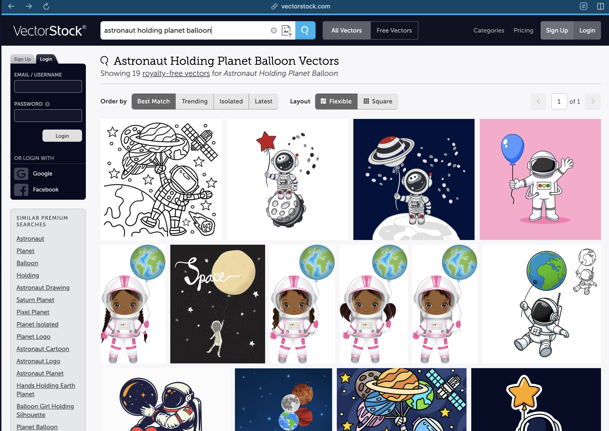
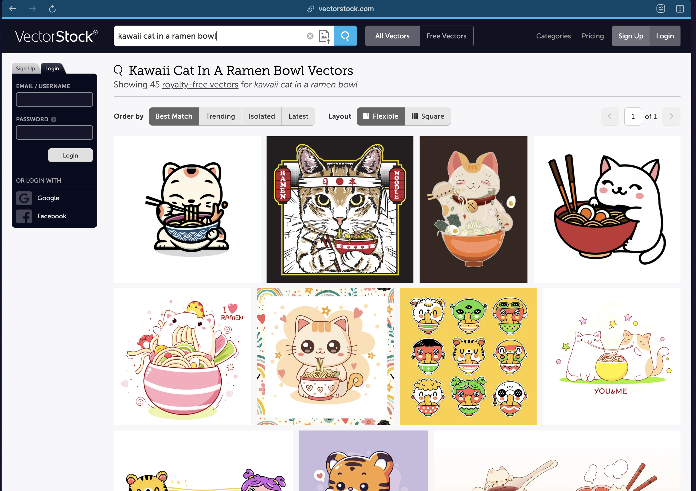

# JED-433: SPIKE: Filtering of Vectorstock images to serve the customer upon search

## Ticket Information

- **Key**: JED-433
- **Type**: Story
- **Status**: Ready for Dev
- **Priority**: P2 - Medium
- **Parent Epic**: JED-417 - "Pick from Our Designs" for Jiffy Print
- **Team**: AI
- **Sprint**: jedai-ai-w35 (August 25 - August 29, 2025)

## Timeline

- **Created**: August 22, 2025
- **Due Date**: August 29, 2025
- **Last Updated**: August 27, 2025

## People

- **Assignee**: Aayush Garg (aayush.garg@jiffyshirts.com)
- **Reporter**: alamin.momin

## Description

**Ask**

As part of this feature where we give customers the ability to chose a pre-created image from Vectorstock, we want to create an effective filtration system that serves the customer the most accurate and print-friendly images.

**Why**

Vectorstock has a massive catalog of images so we don't want to overwhelm the customer when serving these results to the customer

## Checklist

- [ ] [Dev] Description and AC are well-defined ([User Story Template](https://dekeo.atlassian.net/wiki/spaces/JIF/pages/2649981038/User+Story+Template))
- [ ] [Lead] Implementation plan approved

## Additional Details

- **Project**: Jedai (JED)
- **Size**: Large: 1 day to <2 days
- **JIRA URL**: https://dekeo.atlassian.net/browse/JED-433


## Credentials 
"vectorstock@jiffyshirts.com"
"ThLaUXx8a77T8qNfjxu9"
```
curl -X POST "https://api.vectorstock.com/v1/login" -H "accept: application/json" -H "Content-Type: application/json" -d "{ \"username\": \"vectorstock@jiffyshirts.com\", \"password\": \"ThLaUXx8a77T8qNfjxu9\"}"
```
token: NjI2MTE1MTo1MTFiNjliYy00YjU1LTRiZDQtODk0NC01MzYyYTY2ZGVmMDY=

## Comments

### Update August 28, 2025 (Comment 1/2)

I've completed the initial analysis of the VectorStock API endpoints. Below is an overview of the essential API endpoints for our filtering system:

Full API documentation is available at: https://api.vectorstock.com/v1#/

#### Essential VectorStock API Endpoints

| Category | Method | Endpoint | Description |
|----------|--------|----------|-------------|
| **Authentication** | POST | `/v1/login` | Obtain authorization token (required for fetching vector metadata) |
| **Search** | GET | `/p1/search` | Search for vector images with comprehensive filtering options |
| | GET | `/p1/similar` | Search for visually similar vector images |
| **Get Vector Details** | GET | `/v1/get/{art_id}` | Fetch metadata for a single vector image |
| | POST | `/v1/get` | Fetch metadata for multiple vector images |
| **List Vectors** | GET | `/v1/list` | Fetch metadata for initial 1,000 vector images |

#### Search API Parameters (`/p1/search`)

| Parameter | Data Type | Description | Default | Key Values/Range |
|-----------|-----------|-------------|---------|------------------|
| **keywords** * | string | Search term | - | - |
| **category** | string | Filter by category | - | 70+ categories including: abstract, animals-wildlife, business-finance, t-shirt-graphics, etc. |
| **artist** | string | Filter by artist name | - | - |
| **page** | integer | Page number for pagination | - | - |
| **free** | boolean | Search free vectors only | false | - |
| **expanded** | boolean | Expanded license vectors only | false | - |
| **object_detection** | string | Show vectors with distinct objects | false | show_objects, hide_objects |
| **object_count_min** | integer | Minimum distinct objects | - | 1-200 |
| **object_count_max** | integer | Maximum distinct objects | - | 1-200 |
| **svg_only** | boolean | SVG files only | false | - |
| **templates_only** | boolean | Template vectors only | false | - |
| **pod_first** | boolean | Prioritize Print-On-Demand vectors | false | - |
| **cmyk_only** | boolean | CMYK color model only | false | - |
| **png_only** | boolean | Transparent PNG files only | false | - |
| **editorial** | boolean | Include editorial licenses | false | - |
| **color** | string | Hexadecimal color filter | - | e.g., #FF0000 |
| **color_threshold** | integer | Color filtering strength | - | 1-10 |
| **score_popular** | integer | Filter by popularity | - | 1-10 |
| **artist_score** | integer | Filter by artist ranking | - | 1-10 |
| **order** | string | Sort order | - | trending, bestmatch, latest, isolated, featured |

\* Required parameter

#### Key Points:
- **Authentication is mandatory** - The `/v1/login` endpoint must be called first to obtain an authorization token, which is required for fetching any vector image metadata
- The `/p1/search` endpoint provides extensive filtering capabilities specifically useful for print applications:
  - **pod_first**: Prioritizes Print-On-Demand suitable images
  - **cmyk_only**: Ensures print-ready color formats
  - **object_detection**: Helps identify clean, distinct designs
  - **templates_only**: Pre-formatted designs ready for customization
- Additional endpoints are available for purchasing, downloading, and analytics, but these are not required for our current filtering implementation

#### API Documentation:
Full API documentation is available at: https://api.vectorstock.com/v1#/

#### Next Steps:
1. **Analyze Image Metadata Structure**
   - Fetch metadata for sample images using the `/v1/get` endpoint
   - Document the available metadata fields and their potential usefulness for filtering
   - Identify key metadata attributes that indicate print-friendly characteristics

2. **Build VectorStock API Search Dashboard**
   - Develop an interactive dashboard with full search API parameter controls
   - Enable real-time testing of different parameter combinations
   - Visualize search results to evaluate filtering effectiveness
   - Use the dashboard to experiment and design optimal filtering strategies for print-friendly images

### Update August 28th, 2025 (Comment 2/2)

I've made progress on the next steps outlined in my previous comment. Here's the current status:

#### 1. Metadata Exploration - BLOCKED

• I attempted to fetch metadata for sample images using the `/v1/get` endpoint
• **Blocker**: The authentication credentials provided are not working correctly
• I'm unable to obtain a valid authentication token using the current credentials
• Need assistance with obtaining working credentials to proceed with metadata analysis

#### 2. VectorStock API Search Dashboard - COMPLETED ✅

• Built a fully functional Streamlit dashboard
• The dashboard includes:
  • All 20 search API parameters with intuitive UI controls
  • Real-time search functionality with caching to avoid duplicate API calls
  • Advanced filtering and sorting options for results
  • Image preview grid with detailed view functionality and statistics visualization
• **Dashboard is now hosted in the cloud** for team access and testing: https://vectorstock-search-dashboard.streamlit.app/

#### What I Need:

@Vatsal Jha @alamin.momin

1. **Working Authentication Credentials to fetch images metadata**
   • Current credentials appear to be invalid or expired

2. **Example Search Queries for Testing**
   • Please provide 4-5 search queries that represent typical customer needs. This will help me test different parameter combinations and evaluate effectiveness

3. **Print-Ready Image Criteria**
   • What specific characteristics define a "print-perfect" image for our use case?
   • Understanding these criteria will help design the optimal filtering strategy

### Update August 28, 2025 (Comment 3/3)

@Vatsal Jha @alamin.momin

Pausing work on this ticket to focus on a high-priority task, as discussed with @Vatsal Jha. Additionally, we need login credentials and access to vector stock image metadata to proceed. Alex is working on it, and we expect it to be resolved by EOD.

### Update August 29th, 2025 (Comment 1/2)

@Vatsal Jha @alamin.momin

There are four possible approaches to implement VectorStock filtering and ensure we present users with the most relevant images for their queries.

These are outlined in the attached document:

- **Option A** – Simple multi-query aggregation
- **Option B** – Two-stage: multi-query aggregation followed by re-rank
- **Option C** – In-house Text-only index
- **Option D** – Building Hybrid text + image intelligence

Document: https://docs.google.com/document/d/1QJCsX6Tg8qJHQ2GMYAaCbSApJYb4SEaBHtHE6qaGBGk/edit?tab=t.0

I discussed these options with @Vatsal Jha. Since Options B, C, and D involve additional processing at query time or more extensive development work (e.g., building a custom index), he asked me to focus on **Option A** for now. I will proceed with testing Option A to evaluate the results of the multi-query aggregation approach in comparison baseline simple api call.

### Update August 29th, 2025 (Comment 2/2)

• **Baseline Search Results Summary**:

| Search Query | Folder Name | Artworks Fetched | Total Available |
|-------------|-------------|------------------|-----------------|
| minimal mountain badge logo | 20250829_124202 | 100 | 1,452 |
| retro 70s sunset with palm trees | 20250829_124204 | 58 | 58 |
| kawaii cat in a ramen bowl | 20250829_124205 | 0 | 0 |
| geometric low-poly wolf head | 20250829_124207 | 100 | 152 |
| vintage motorcycle club emblem | 20250829_124208 | 100 | 3,246 |
| bold typography "GOOD VIBES" | 20250829_124211 | 100 | 209 |
| floral sugar skull | 20250829_124212 | 100 | 5,941 |
| astronaut holding a planet balloon | 20250829_124214 | 0 | 0 |
| japanese wave line art | 20250829_124215 | 100 | 5,804 |
| seamless doodle pattern | 20250829_124217 | 100 | 294,421 |
| Red angry bull | 20250829_124219 | 100 | 3,113 |

***Note: These are the search results obtained from a simple keyword search without applying any additional parameters.***

• **Key Findings - API Discrepancy Identified**

@Vatsal Jha @alamin.momin

- Interestingly, for two queries ("**kawaii cat in a ramen bowl**" and "**astronaut holding a planet balloon**"), the API returned zero results.
- However, when testing the same queries directly on the VectorStock website, relevant results are available.
  - See these results:
    - https://www.vectorstock.com/royalty-free-vectors/astronaut-holding-planet-balloon-vectors
    - https://www.vectorstock.com/royalty-free-vectors/kawaii-cat-in-a-ramen-bowl-vectors





- **This indicates a potential discrepancy between their API search functionality and their website search implementation.**

### Update August 29th, 2025 (Comment 3/4)

**Multi-Query Approach Implementation Details**

Following our discussion about Option A (simple multi-query aggregation), I've implemented and tested this approach. Here's how our system works:

#### Query Generation Process

• **Step 1: Query Transformation with LLM**
  - We use GPT (non-thinking mode) as our Vision Language Model to transform each user query into 6 complementary search variations
  - The prompt engineering (found here [user_prompt.md file attachment]) ensures diverse yet relevant results by requiring:
    - 3 queries use exact user keywords, 3 use synonyms/variations
    - 1 baseline query (keywords only, no filters)
    - 3 queries without category restrictions (search across all)
    - 3 queries with T-shirt-suitable categories (e.g., "t-shirt-graphics", "logos", "silhouettes")
    - Mix of print-friendly parameters: `svg_only`, `png_only`, `cmyk_only`, `pod_first`
    - Variety in sorting: "bestmatch", "trending", "latest", "featured"
    - At least one popularity-biased slice (`score_popular >= 7`)

• **Step 2: Asynchronous Search Execution**
  - All 6 search queries are executed in parallel using the VectorStock API and returns up to 100 results (API limit)

#### Results Pruning Algorithm

• **Step 3: Intelligent Result Selection (100 Images)**
  - Based on the constraints that we do not want to fetch metadata and do any processing (for latency), we developed pruning algorithm that creates a balanced subset of 100 images
  - The algorithm follows this priority logic:
    - **Priority 1 - Cross-Query Relevance**:
      - Images appearing in multiple search results are prioritized first. These represent the most relevant matches across different query variations
    - **Priority 2 - Minimum Representation**:
      - Ensures at least 10 images from each of the 6 search queries
      - Guarantees diversity in the final selection
    - **Priority 3 - Proportional Distribution**:
      - Remaining slots are filled proportionally based on each query's result count. Queries with more results get more representation
    - **Priority 4 - Fill to Target**:
      - Any remaining slots are filled with available images to reach exactly 100
    - **Priority 5 - Randomization**:
      - Final selection is shuffled to avoid position bias

This implementation provides a robust filtering system that effectively narrows down VectorStock's massive catalog to a curated set of 100 print-friendly, relevant images for each customer query.